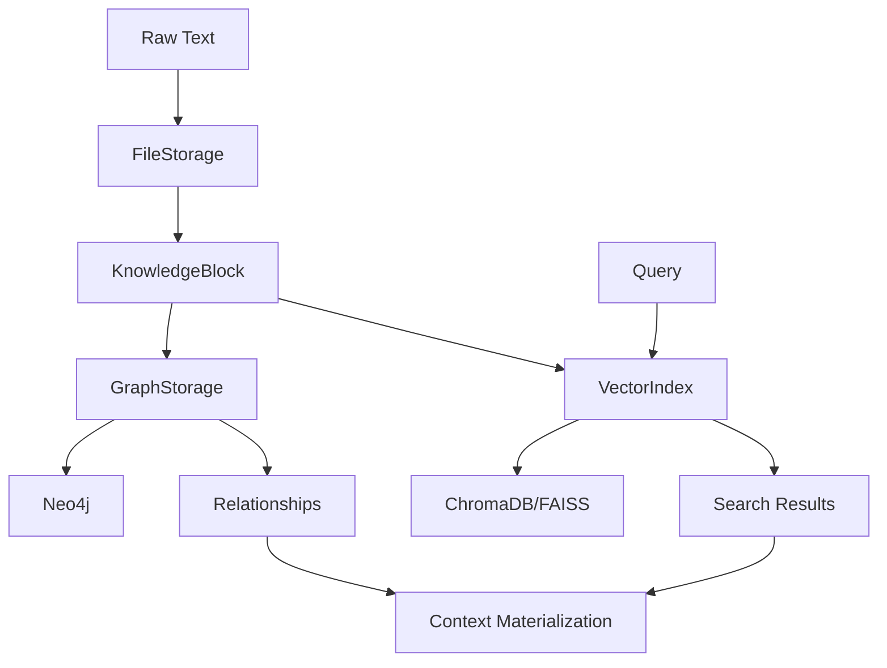

# Cognitive Memory Core

A hybrid AI memory system that combines file-based storage (Markdown/JSON), graph database (Neo4j), and vector search (ChromaDB/FAISS) for intelligent knowledge management.

## Features

- **File Storage**: Human-editable Markdown/JSON knowledge blocks with frontmatter metadata
- **Graph Layer**: Neo4j integration for relationship tracking and semantic connections
- **Vector Layer**: ChromaDB/FAISS for semantic similarity search using embeddings
- **Pipeline**: End-to-end memory operations: record, encode, link, retrieve, reflect, compress, decay, materialize
- **CLI**: Command-line interface for ingesting, linking, and querying knowledge blocks

## Architecture



## Installation

### Prerequisites

- Python 3.10+
- [UV](https://github.com/astral-sh/uv) package manager
- Docker and Docker Compose (for Neo4j and ChromaDB services)

### Setup

1. Clone the repository:
```bash
git clone https://github.com/tnedr/cognitive-memory-core.git
cd cognitive-memory-core
```

2. Create virtual environment and install dependencies:
```bash
# Create minimal venv (UV handles the rest)
python -m venv .venv --symlinks

# Install dependencies using UV (uses global cache at E:\uv-cache)
uv pip install -e .
```

**Note**: This project uses UV cache for efficient package management. The global cache location is configured via `UV_CACHE_DIR` environment variable (default: `E:\uv-cache`). This allows fast installs and minimal disk usage per project.

3. Start services (optional, for full functionality):
```bash
cd docker
docker-compose up -d
```

This will start:
- Neo4j on `http://localhost:7474` (Bolt: `bolt://localhost:7687`)
- ChromaDB on `http://localhost:8000`

## Usage

### CLI Commands

#### Ingest a knowledge block

```bash
# Using UV (recommended)
uv run python -m src.cli ingest knowledge/2025-11-06-memory-design.md

# Or activate venv first
.venv\Scripts\activate  # Windows
python -m src.cli ingest knowledge/2025-11-06-memory-design.md
```

#### Auto-link related blocks

```bash
uv run python -m src.cli autolink KB-20251106-001
```

#### Materialize context for a goal

```bash
uv run python -m src.cli context "Explain hybrid memory architecture"
```

#### Search for knowledge blocks

```bash
uv run python -m src.cli search "memory system" --top-k 5
```

#### List all blocks

```bash
uv run python -m src.cli list-blocks
```

### Python API

```python
from cmemory import MemorySystem

# Initialize the memory system
memory = MemorySystem(
    knowledge_path="knowledge",
    neo4j_uri="bolt://localhost:7687",
    neo4j_user="neo4j",
    neo4j_password="password",
)

# Record a new knowledge block
block_id = memory.record(
    "Python is a high-level programming language.",
    {"id": "KB-001", "title": "Python Intro", "tags": ["python"]}
)

# Encode into vector embeddings
memory.encode(block_id)

# Link related blocks
memory.link("KB-001", "KB-002", "references")

# Retrieve relevant blocks
results = memory.retrieve("programming languages", top_k=5)

# Materialize context
context = memory.materialize_context("Explain Python", max_tokens=4096)
```

## Knowledge Block Format

Knowledge blocks are stored as Markdown files with YAML frontmatter:

```markdown
---
id: KB-20251106-001
title: Memory System Architecture
tags: [memory, hybrid, Neo4j, vector]
created: 2025-11-06T14:32:00Z
---

# Content here

The actual knowledge content goes here...
```

## Development

### UV Cache Workflow

This project uses UV for efficient package management with a global cache:

- **Global cache**: `E:\uv-cache` (configured via `UV_CACHE_DIR`)
- **Project venv**: Minimal, mostly symlinks (`.venv/`)
- **Dependencies**: Stored in global cache, shared across projects

**Benefits**:
- Fast installs from cache (10x faster for cached packages)
- Minimal disk usage per project (80-90% reduction)
- Consistent packages across projects

**Workflow**:
```bash
# Install/update dependencies (uses cache automatically)
uv pip install -e .

# Run commands
uv run python -m src.cli --help
uv run pytest tests/

# Check cache location
uv cache dir
```

### Running Tests

```bash
# Using UV (recommended)
uv run pytest tests/ --cov=src/cmemory --cov-report=html

# Or with activated venv
pytest tests/ --cov=src/cmemory --cov-report=html
```

### Code Quality

Pre-commit hooks are configured for:
- `black` - Code formatting
- `isort` - Import sorting
- `flake8` - Linting

Install pre-commit:
```bash
pip install pre-commit
pre-commit install
```

### Project Structure

```
cognitive-memory-core/
├── src/
│   ├── cmemory/              # Python package
│   │   ├── storage/          # Markdown/JSON file handling
│   │   ├── graph/            # Neo4j integration
│   │   ├── vector/           # ChromaDB/FAISS wrapper
│   │   ├── pipeline/         # End-to-end flow
│   │   └── models.py         # Data models and DTOs
│   └── cli.py                # Command-line interface
├── tests/                    # Test suite
├── knowledge/                # Knowledge block files
├── docker/                   # Docker Compose configuration
└── requirements.txt          # Dependencies
```

## Fallback Behavior

The system gracefully falls back when services are unavailable:

- **Neo4j**: Falls back to in-memory graph storage
- **ChromaDB**: Falls back to FAISS for vector search
- **Embeddings**: Uses dummy embeddings if sentence-transformers is not available

## Performance

- `cmemory context` command returns relevant blocks in < 2 seconds for 10k knowledge files
- Vector search uses efficient approximate nearest neighbor algorithms
- Graph queries are optimized with Neo4j indexes

## Contributing

1. Fork the repository
2. Create a feature branch
3. Make your changes
4. Add tests
5. Ensure all tests pass and coverage is ≥ 90%
6. Submit a pull request

## License

MIT License

## Changelog

See [CHANGELOG.md](CHANGELOG.md) for version history.

