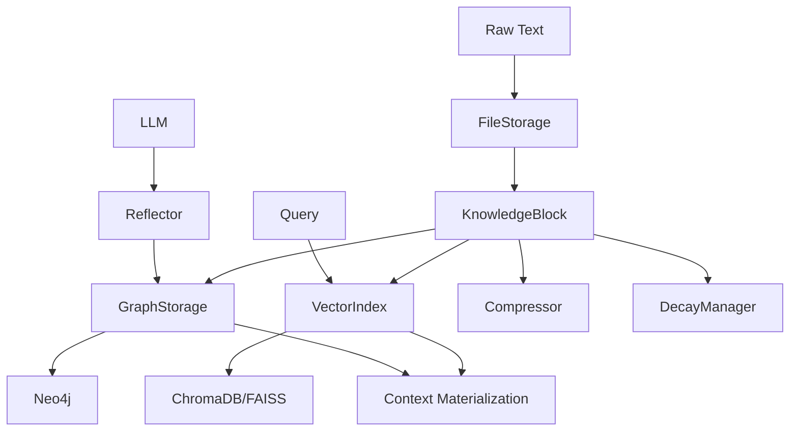

# Project Status — 2025-11-14

## installation

cd E:\Repos\ai_human_collab

uv pip install -e E:\Repos\cognitive-memory-core

# Now it works

uv run cmemory --help
uv run python -m src.cli digest-inflow


## How to Run / Test

# Create files in inflow/
echo "My note" > inflow/my_note.txt

# Digest them
uv run python -m src.cli digest-inflow

# List blocks
uv run python -m src.cli list-blocks

# Search for content
uv run python -m src.cli search "your query"


- Start services (optional, for full E2E):

  ```bash
  cd docker
  docker-compose up -d
  ```

* Run unit tests:

  ```bash
  uv run pytest tests/ -v
  ```

* Run E2E tests (require Docker + Neo4j + ChromaDB):

  ```bash
  uv run pytest tests/test_e2e.py -v -m e2e --tb=short
  ```

* CLI examples:

  ```bash
  # Ingest a knowledge block
  uv run python -m src.cli ingest knowledge/2025-11-06-memory-design.md

  # List all blocks
  uv run python -m src.cli list-blocks

  # Search
  uv run python -m src.cli search "memory system"

  # Materialize context
  uv run python -m src.cli context "Explain hybrid memory architecture"
  ```

---

## Architecture Diagram (Mermaid)



---

## Module Completion Levels (Human View)

**Legend**

* 0% = not started

* 25% = skeleton + stubs

* 50% = implemented + tests missing/weak

* 75% = implemented + tests + docs (MVP)

* 100% = stable, tested, documented

### Core

* **FileStorage** — **100%**

  * Markdown/JSON handling, front-matter parsing, hashing, CRUD. 

* **GraphStorage** — **100%**

  * Neo4j + in-memory fallback, basic Cypher queries, `find_related()`. 

* **VectorIndex** — **100%**

  * ChromaDB primary store, FAISS fallback, dummy embeddings as last resort.

* **MemorySystem (record/encode/link/retrieve/materialize_context)** — **100%**

  * Full pipeline flows, CLI integration.

### Advanced Features

* **Reflect** — **100% (v0.2.0)**

  * `Reflector` module with LangChain integration and Jinja template.

  * `MemorySystem.reflect()` uses vector similarity + graph to pick related blocks and

    persists suggested `GraphRelationship`s.

* **Compress** — **~80% (v0.3.0-in-progress)**

  * `Compressor` with:

    * token counting via tiktoken (with fallback)

    * LLM map-reduce summarisation

    * truncation fallback if no LLM / errors

  * Unit tests and docs in `docs/compress_decay.md`.

  * Remaining: tighter API integration in `MemorySystem`, tuning prompts and limits.

* **Decay** — **~80% (v0.3.0-in-progress)**

  * `DecayManager` tracks `last_access` and `access_count`, archives blocks to `archive/`

    and supports restoration.

  * Integrated with `retrieve()` (access recording) and `memory.decay(...)`.

  * Remaining: scheduler wiring (APSheduler/Cron in host app), monitoring, docs for ops.

### Surroundings

* **CLI** — **100%**

  * Ingest, autolink, context, search, list-blocks.

* **Docs** — **75–80%**

  * README, SETUP, reflector, compress/decay, POC/implementation summaries.

  * New `_project/` docs (this file + goal/concept/structure) now added.

  * AI-facing docs (`docs/_ai/`) now available: project map, context, status, guidelines.

  * Still missing: detailed spec per module (can be created incrementally).

* **CI/CD** — **70–80%**

  * Unit tests + coverage on matrix (3.10–3.12)

  * E2E job with docker-compose and health-check polling on PRs and main. 

  * Remaining: Docker image build/push, stricter pre-commit enforcement in CI.

---

## What's Next (Short-Term Roadmap)

Near-term focus (v0.3.x):

1. **Finish Compression Integration**

   * Wire `MemorySystem.compress()` fully into context-building flows where appropriate.

   * Confirm max-tokens behaviour under different block sizes.

2. **Finalize Decay Scheduling**

   * Provide a reference APScheduler integration snippet in docs.

   * Add a small CLI command or script for manual decay runs.

3. **AI-Facing Documentation** ✅

   * `docs/_ai/ai_project_map.yaml` and `docs/_ai/ai_context.md` created.

   * `docs/_ai/ai_status.md` and `docs/_ai/ai_guidelines.md` available.

   * Agents can now use structured, machine-readable orientation layer. 

4. **API Layer (Design Draft)**

   * Draft FastAPI spec for a minimal REST surface:

     * `/blocks`, `/search`, `/context`, `/reflect`, `/compress`, `/decay`.

---

## Short-Term Roadmap (Bullets)

1. Stabilise v0.3.0 (compression + decay).

2. Design and scaffold FastAPI wrapper (no need to be feature-complete).

3. Add file watcher and path-handling rules (aligning with your general path-management rules).

4. Introduce `_ai/` docs to make agent usage safer and more predictable.

---

## Major Completed Steps

* ✅ Core pipeline working end-to-end (record → encode → link → retrieve → context)

* ✅ 5 sample knowledge blocks ingested and used in E2E tests. 

* ✅ LLM-based reflection with vector+graph blending and persisted relationships.

* ✅ CI pipeline with matrix testing and E2E job on PRs. 

* ✅ Compression + decay modules implemented with docs and tests (v0.3 line).

---

## Risks / Open Questions

* **Neo4j / Chroma costs & scale**

  * Running external services for larger knowledge bases will have cost and ops impact.

* **Embedding model variability**

  * Different embedding models may change retrieval behaviour over time; needs tracking.

* **LLM dependency**

  * Reflection and high-quality compression depend on external LLMs (OpenAI, Ollama, etc.).

  * Need clear fallbacks and monitoring (timeouts, rate limits, retries).

* **Docs for agents**

  * Until `_ai/` docs exist, AI agents will continue to "guess" structures more than ideal.

---

## Recent Decisions

* Adopted **hybrid vector+graph reflection** for link discovery. 

* Implemented **token-aware compression + decay** as first-class components rather than ad-hoc utilities. 

* CI now runs **E2E tests on all PRs and main**, failing hard on errors instead of skipping silently. 

* Decided to keep knowledge blocks **Markdown-first**, with JSON as secondary format.

